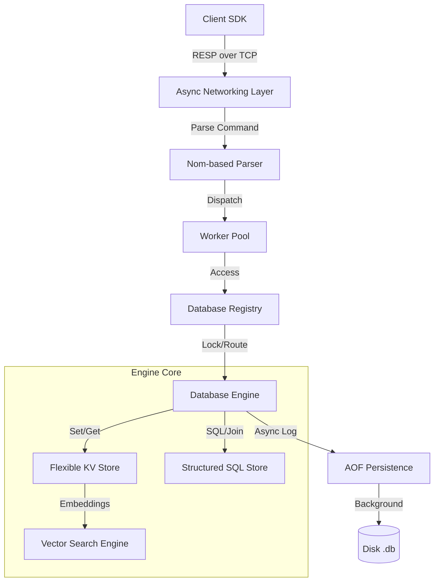

# Architecture & Internals (⛩️)

This document provides a deep dive into the internal mechanics of the **ToriDB** engine, covering request lifecycle, data modeling, and performance characteristics.

## 1. High-Level Design
ToriDB is designed for **Extreme Low Latency** and **Hybrid Versatility**. It utilizes a share-nothing (per-worker) and concurrent-core (global registry) hybrid architecture.

### Data Flow Diagram

---

## 2. Component Deep Dive

### 2.1 Async Networking (Tokio)
The server leverages **Tokio** and the `bytes` crate for zero-copy buffer management.
- **Multiplexing**: Single-threaded event loop handles thousands of connections.
- **Protocol**: Uses binary-safe RESP (Redis Serialization Protocol), extending it with multi-statement support.

### 2.2 Worker Pool Strategy
Instead of the "Thread-per-connection" pattern which leads to context switching overhead, ToriDB uses a **fixed-size worker pool** (default: 50 threads).
- **Session Isolation**: Each connection carries a `Session` object holding authentication and transaction state.
- **Work Stealing**: Workers pull requests from a global MPSC channel, ensuring balanced CPU utilization.

### 2.3 Hybrid Storage Layer
ToriDB bridges two worlds using a unified memory management system:
- **Flexible Store**: Built on `DashMap` for lock-free reads and fine-grained write locking. Handles Lists, Sets, and JSON.
- **Structured Store**: Implements a lightweight relational engine with schema enforcement and B-Tree indexing.
- **Vector Engine**: Performs **Cosine Similarity** rankings across normalized vector columns for embedding retrieval.

---

## 3. Persistence & Reliability

### 3.1 AOF (Append Only File)
Every write operation is checksummed via **CRC32** and asynchronously logged to disk.
- **Recovery**: On startup, the engine replays the AOF log to reconstruct the in-memory state.
- **Rewrite**: Periodic background rewriting merges overlapping keys to minimize file size.

### 3.2 ACID Transactions
ToriDB supports atomic multi-operation transactions:
1. `BEGIN`: Initializes a private `tx_buffer` in the client session.
2. `Execution`: Commands are validated and staged but not applied to the global state.
3. `COMMIT`: Acquires the engine-level transaction lock and applies all staged changes atomically to memory and AOF.

---

## 4. Clustering & Distribution
ToriDB uses **Virtual Slots** (0-16383) to distribute data across nodes.
- **Gossip Protocol**: Nodes exchange health and ownership maps.
- **Redirection**: Clients receive `MOVED <slot> <ip>` responses when querying keys not owned by the connected node.

---
[Back to Home](../README.md)
